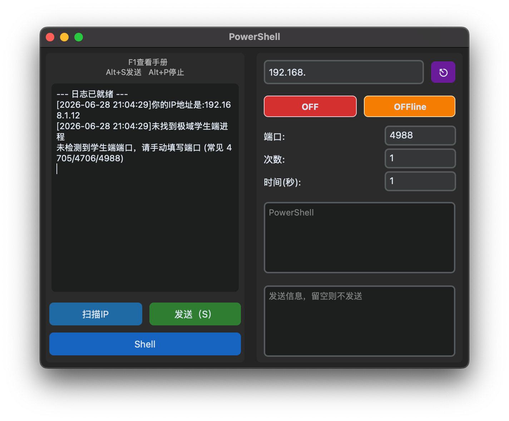

<div align="center">


# JIYU_UDPAttack

> **本软件通过极域电子教室漏洞实现对目标学生端执行命令,发送消息等功能**

> **亲测2025 v6.0豪华版可用**


---


---

## ✨ 特性与功能说明

| 功能 | 说明 |
|---|---|
| 🔍 **局域网扫描** | 自动探测本网段内所有存活主机，识别 IP 地址 |
| 📴 **OFF** | 关机目标ip |
| 📴 **OFFline** | 重启目标ip |
| ⎇ **powershell** | 输入要运行的cmd指令 |
| 💬 **发送消息** | 以教师端身份向目标ip发送消息 |
| ✅ **发送** | 向目标ip发送cmd指令或消息 |
| 🕒 **常用命令表**| 按F1打开常用命令表(ps:并不是每个都有效果,大部分是叫ai生成的) |
| 🎨 **现代暗色 UI** | 深色主题设计,扁平化UI,富有现代感 |
| 🌐 **多线程并发** | 如果你把所有ip用;隔开塞进去,那么就能实现一秒内全班关机 |
| 👻 **伪装命名** | 这个不多说 |
| ⎋ **扫描端口**| 自动匹配学生端端口 |
| ⌥ **反弹shell** | 这个没实测过,能不能用不知道 |

</div>

> **注意**：项目界面使用了伪装命名（如"OFF"、"OFFline"、"Powershell"等）的隐喻.每轮发送后会有一个约10秒的冷却时期,该期间内若再次发送将重新计时

---
## 📷 软件截图


---

## 📁 项目结构
```
 UDP/
    ├── [PY] attackCore.py     数据包存放位置
    ├── [PY] UDP_Attack.py     主界面
    └── [PY] F1HELP.py         F1常用命令表存放位置
    └── [PS1] p.ps1            反弹shell依赖
```

---

### 📦 安装依赖

```bash
pip install customtkinter
```

### 📦打包为exe

> 需要先安装 `pyinstaller `

```bash
pip install pyinstaller 
```
> 打包
```bash
pyinstaller --onefile -w -i .\logo.ico --add-data "p.ps1;." .\UDP_Attack.py
```

## ⚠️ 免责声明

本项目仅供**学习和研究**目的，用于理解 UDP 协议原理和网络安全知识。

- 请在**授权的网络环境**中使用本工具
- 作者不对因使用本工具造成的任何损失或法律责任承担责任
- 使用本工具即表示您已阅读并同意上述条款
